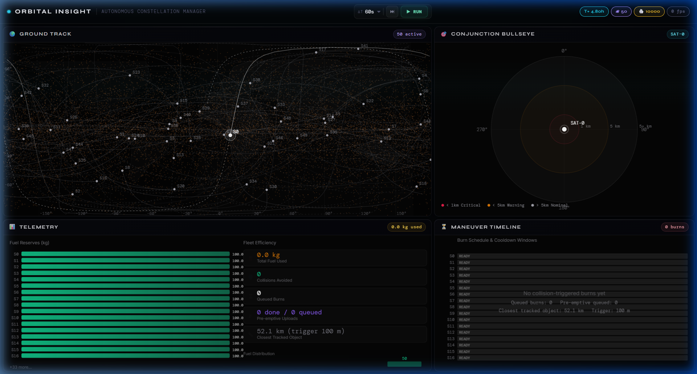

<div align="center">


# AstroVigil — Project Debris

### Autonomous Constellation Manager for LEO Debris Avoidance

*A full-stack operational platform that autonomously coordinates a fleet of 50 satellites navigating 10,000+ debris objects using predictive physics, KD-Tree spatial intelligence, and pre-emptive ground-station-aware burn scheduling — rendered live in a professional mission-control dashboard.*

<p align="center">
  
</p>

---

[](https://python.org)
[](https://fastapi.tiangolo.com)
[](https://react.dev)
[](https://vitejs.dev)
[](https://numpy.org)
[](https://scipy.org)
[](https://docker.com)
[](LICENSE)

</div>

---

## 🌌 What Is This?

The **Low Earth Orbit (LEO) environment is becoming critically congested.** With over 27,000 tracked debris objects and thousands of active satellites, autonomous collision avoidance is no longer optional — it is a mission-critical engineering challenge.

**AstroVigil** is an end-to-end simulation and operations platform that answers: *"How does an autonomous ground system manage a constellation through a debris field, anticipate threats before they happen, and keep burning when the satellites are out of contact?"*

This project implements:

- ⚡ **Real orbital mechanics** — RK4 integration with J2 zonal harmonic perturbation in ECI frame
- 🌐 **O(N log N) collision detection** — SciPy cKDTree across 50 satellites × 10,000 debris objects
- 🔭 **90-minute Look-Ahead Tree** — recursive delta-v refinement to ensure secondary threats on the evasion path are also cleared
- 📡 **Blackout Zone Anticipation** — detects upcoming coverage gaps and pre-emptively uploads burns via the last available ground station, with 10-second signal latency accounting
- 🎛️ **Live Mission-Control Dashboard** — 1-second polling, 60 FPS canvas rendering, zero dropped frames

---

## 🏗️ System Architecture

```
┌─────────────────────────────────────────────────────────────────────────┐
│                        ORBITAL INSIGHT — DASHBOARD                      │
│                  React 18 + Vite · Framer Motion · Canvas 2D            │
│                                                                         │
│  ┌────────────────────────┐  ┌──────────────────────────────────────┐   │
│  │   🌍 Ground Track Map  │  │      🎯 Conjunction Bullseye Plot    │   │
│  │   Mercator + Terminator│  │   Polar · TCA radial · Risk colors   │   │
│  ├────────────────────────┤  ├──────────────────────────────────────┤   │
│  │  📊 Telemetry Panel    │  │     ⏳ Maneuver Timeline (Gantt)     │   │
│  │  Fuel bars · Histogram │  │  Burns · Cooldown · 📡 Pre-empt burns│   │
│  └────────────────────────┘  └──────────────────────────────────────┘   │
└──────────────────────────────┬──────────────────────────────────────────┘
                               │ REST/JSON  ·  1-second live polling
┌──────────────────────────────▼──────────────────────────────────────────┐
│                      FastAPI Backend  :8000                             │
│                                                                         │
│  ┌──────────────────┐  ┌─────────────────┐  ┌───────────────────────┐  │
│  │  Physics Engine  │  │ Spatial Indexer │  │    Fuel & Comms Model │  │
│  │  RK4 + J2 Pert.  │  │ cKDTree O(NlogN)│  │ Tsiolkovsky · LOS    │  │
│  └────────┬─────────┘  └────────┬────────┘  └──────────┬────────────┘  │
│           └─────────────────────┼──────────────────────┘               │
│                    ┌────────────▼────────────────┐                      │
│                    │   SimulationWorld            │                      │
│                    │   Look-Ahead Tree (90-min)   │                      │
│                    │   Blackout Pre-emption       │                      │
│                    │   Maneuver Queue + History   │                      │
│                    └─────────────────────────────┘                      │
└─────────────────────────────────────────────────────────────────────────┘
```

---

## 🚀 Two-Minute Quick Start

### Option A — Dev Launcher (Recommended)

```bash
git clone https://github.com/your-org/astrovigil.git
cd astrovigil

# Install backend deps
pip install -r backend/requirements.txt

# Install frontend deps
cd frontend && npm install && cd ..

# Start backend + frontend together (Ctrl+C to stop both)
python dev.py --full
```

| Interface | URL |
|---|---|
| 🎛️ Live Dashboard | http://localhost:5173 |
| 📖 Interactive API Docs | http://localhost:8000/docs |
| ❤️ Health Check | http://localhost:8000/api/health |

> `dev.py` auto-kills any stale process on port 8000 before starting, so it is safe to re-run.

---

### Option B — Docker

> **Requires Docker Desktop to be running.** Start Docker Desktop, wait for the engine to be ready (whale icon in system tray turns solid), then:

```bash
docker compose up --build
```

Access the dashboard at **http://localhost:8000** (frontend is served as a pre-built static bundle).

---

### Option C — Manual (two terminals)

```bash
# Terminal 1 — Backend
pip install -r backend/requirements.txt
python -m uvicorn backend.main:app --host 0.0.0.0 --port 8000

# Terminal 2 — Frontend
cd frontend
npm install
npm run dev
```

---

## 🧠 Core Intelligence — How It Works

### 1. Orbital Propagation (Physics Engine)

Every object in the simulation is propagated in the **ECI (Earth-Centred Inertial) frame** using a 4th-order Runge-Kutta integrator with the **J2 zonal harmonic** perturbation — the dominant secular force in LEO caused by Earth's equatorial bulge.

```
State vector: [x, y, z, vx, vy, vz]  (meters, m/s)

RK4:  k₁ = f(sₙ)
      k₂ = f(sₙ + ½·Δt·k₁)
      k₃ = f(sₙ + ½·Δt·k₂)
      k₄ = f(sₙ + Δt·k₃)
      sₙ₊₁ = sₙ + (Δt/6)·(k₁ + 2k₂ + 2k₃ + k₄)

J2 acceleration:
      aⱼ₂ = -μ/r³ · r⃗ · [1 + 1.5·J2·(Rₑ/r)² · (1 - 5z²/r²)]
```

---

### 2. KD-Tree Spatial Indexing

A **SciPy cKDTree** is rebuilt every simulation step over all 10,050 objects (50 satellites + 10,000 debris), enabling:

- `detect_collisions()` — `O(N log M)` radial ball queries per satellite against all objects, 100m threshold
- `find_conjunctions()` — returns the 10 closest threats per satellite with TCA, miss distance, and bearing angle for the Bullseye Plot
- `query_path_safety()` — samples a 90-point future trajectory and checks each position against the tree; returns the first threatened step

---

### 3. Predictive Multi-Threat Look-Ahead Tree

When a primary collision is detected, AstroVigil does **not** simply fire a burn and move on.

```
Primary collision detected  (miss_distance < 100m)
         │
         ▼
_compute_evasion_dv()        → radial outward impulse candidate
         │
         ▼
_verify_safe_path()          → apply dv to a COPY of sat state
         │                     propagate 90 minutes (60s samples)
         │                     query_path_safety() on each step
         │
    ┌────┴──────────────────────────────────────┐
    │ Secondary threat found?                   │
    │  YES → Strategy 1: scale dv up ×1.5      │
    │         still unsafe?                     │
    │          → Strategy 2: rotate 45° around │
    │            orbit normal (Rodrigues)       │
    │            recurse (max 5 levels deep)   │
    │  NO  → verified_dv returned              │
    └───────────────────────────────────────────┘
```

The recursion cap is `MAX_RECURSION_DEPTH = 5` with alternating scale/rotation strategies. If no safe path is found in 5 attempts, the maneuver is skipped and flagged — no burn is better than the wrong burn.

---

### 4. Blackout Zone Anticipation

After a safe delta-v is verified, the system checks:

```python
station_at_collision = get_visible_station(
    propagate(sat_state, collision_epoch - now),
    collision_epoch
)
```

**If the satellite is in coverage:** schedule the burn immediately with `+10s` signal latency.

**If the satellite is in a blackout zone:**
```
find_next_los_window(sat_state, collision_epoch)
         │
         │  Walks backward from collision_epoch in 30s steps
         │  Propagates state backward at each step
         │  Checks elevation angle against all 8 ground stations
         │
         ▼
Returns (uplink_epoch, station_name) — the last window before blackout

Schedule evasion burn   at uplink_epoch  (absorbed into LOS window)
Schedule recovery burn  at uplink_epoch + COOLDOWN_S + 10s
```

Pre-emptive burns are flagged `blackout_preemptive: true` and rendered in **violet (📡)** on the Maneuver Timeline so operators can distinguish them from standard reactive burns.

---

### 5. Ground Station Network

8 globally distributed stations validated for line-of-sight using spherical Earth elevation angle geometry:

| Station | Location | Min Elevation |
|---|---|---|
| Goldstone | California, USA | 5° |
| Canberra | Australia | 5° |
| Madrid | Spain | 5° |
| Svalbard | Norway (Arctic) | 5° |
| Singapore | Southeast Asia | 5° |
| McMurdo | Antarctica | 5° |
| Bangalore | India | 5° |
| Kourou | French Guiana | 5° |

---

## 🎛️ Dashboard Panels

### 🌍 Ground Track Map
Real-time Mercator projection rendered in HTML5 Canvas at 60 FPS:
- Live satellite markers with selection highlight
- 90-min historical trails (fading opacity)
- 90-min predicted trajectory (dashed lines)
- Dynamic **day/night terminator line** (solar declination from epoch)
- 10,000-point debris cloud (compressed flat array transmission: `[ID, Lat, Lon, Alt, ...]`)
- Click a satellite marker to focus the Bullseye Plot on it

### 🎯 Conjunction Bullseye Plot
Polar chart centered on the selected satellite:
- **Radial axis** = miss distance (log-scaled zones: <1km, <5km, >5km)
- **Angular axis** = approach bearing relative to satellite velocity vector
- 🔴 Critical · 🟡 Warning · ⚫ Nominal risk colour coding
- Renders cleanly at any container size (labels auto-hide below 250px width)

### 📊 Telemetry Panel
Fleet health at a glance:
- Per-satellite fuel bars with Emerald → Amber → Rose colour gradient
- Fleet efficiency statistics (fuel consumed, collisions avoided, active satellites)
- 5-bucket fuel distribution histogram across the entire constellation

### ⏳ Maneuver Timeline (Gantt)
Operational burn schedule visualised in time:
- ⬜ **White** blocks = standard reactive burns
- 🟣 **Violet** blocks with 📡 badge = blackout pre-emptive burns
- 🟧 **Amber hatched** windows = 600-second thermal cooldown
- 🔺 **Red triangle** = scheduling conflict detected
- Vertical NOW marker with current simulation epoch

---

## 📡 API Reference

### POST `/api/simulate/step`
Advance the simulation, execute queued burns, detect collisions, run the Look-Ahead Tree.

```json
Request:   { "step_seconds": 60.0 }

Response:  {
  "current_epoch": 3600.0,
  "step_seconds": 60.0,
  "satellites_propagated": 50,
  "debris_propagated": 10000,
  "maneuvers_executed": 2,
  "collisions_detected": [],
  "avoidance_burns_scheduled": 1,
  "blackout_preemptive_count": 1
}
```

### GET `/api/visualization/snapshot`
Full constellation state snapshot (called every 1 second by the dashboard).

```json
{
  "epoch": 3600.0,
  "satellites": [
    {
      "id": 0, "lat": 34.5, "lon": -118.2, "alt": 550000,
      "fuel_remaining_kg": 94.1, "cooldown_remaining_s": 0.0,
      "trail": [[34.1, -120.0], ...],
      "predicted": [[35.2, -115.0], ...]
    }
  ],
  "debris_compressed": [1000, 12.3, -45.6, 450000, 1001, ...],
  "conjunctions": [
    {
      "satellite_id": 0, "debris_id": 1042,
      "miss_distance_m": 342.5,
      "tca": 3645.0, "bearing_deg": 128.3,
      "risk_level": "yellow"
    }
  ],
  "maneuver_timeline": [
    {
      "satellite_id": 0, "burn_start": 3210.0, "burn_end": 3210.0,
      "cooldown_end": 3810.0, "delta_v_mag": 0.5,
      "blackout_preemptive": true, "preempt_station": "Svalbard"
    }
  ],
  "total_fuel_consumed_kg": 1.23,
  "total_collisions_avoided": 4
}
```

### POST `/api/maneuver/schedule`
Schedule manual burn commands with full constraint validation.

```json
Request:  {
  "burns": [{
    "satellite_id": 5,
    "burn_time": 7200.0,
    "delta_vx": 0.0, "delta_vy": 0.5, "delta_vz": 0.0
  }]
}

Response: {
  "scheduled": 1, "rejected": 0,
  "results": [{ "satellite_id": 5, "accepted": true, "fuel_remaining_kg": 93.4 }]
}
```

### POST `/api/telemetry`
Ingest external ECI state vectors (for integration with real TLE/SGP4 sources).

---

## 📁 Project Structure

```
astrovigil/
├── dev.py                      # Unified dev launcher (auto-frees port 8000)
├── docker-compose.yml          # Production container config
├── Dockerfile                  # Ubuntu 22.04 multi-stage build
│
├── backend/
│   ├── main.py                 # FastAPI app — 6 REST endpoints
│   ├── config.py               # All physical constants & ground stations
│   ├── simulation.py           # World state manager + Look-Ahead Tree + Blackout pre-emption
│   ├── physics_engine.py       # RK4 integrator, J2 perturbation, ECI↔geodetic
│   ├── fuel_model.py           # Tsiolkovsky, LOS check, find_next_los_window()
│   ├── spatial_indexer.py      # cKDTree — detect, conjunctions, query_path_safety()
│   ├── legacy_models.py        # Pydantic schemas (request/response)
│   ├── requirements.txt
│   └── api/                    # Modular route handlers
│       └── routes/
│           ├── satellites.py
│           ├── propagator.py
│           ├── conjunction.py
│           └── maneuver.py
│
└── frontend/
    ├── vite.config.js          # Proxy /api → :8000, port 5173
    ├── src/
    │   ├── App.jsx             # Shell, header, dual polling loops
    │   ├── api.js              # Fetch wrappers
    │   └── components/
    │       ├── Dashboard.jsx           # Responsive 2×2 grid, panel chrome
    │       ├── GroundTrackMap.jsx      # Mercator canvas, terminator, click-to-select
    │       ├── BullseyePlot.jsx        # Polar canvas, adaptive labels
    │       ├── TelemetryPanel.jsx      # Fuel bars, histogram canvas
    │       ├── ManeuverTimeline.jsx    # Gantt canvas, 📡 preempt rendering
    │       └── useResponsiveCanvas.js  # ResizeObserver DPR-aware canvas hook
    └── package.json
```

---

## ⚙️ Configuration Reference

All tunable constants live in `backend/config.py`:

| Parameter | Value | Description |
|---|---|---|
| `DEFAULT_NUM_SATELLITES` | 50 | Active satellites (env: `ACM_DEFAULT_NUM_SATELLITES`) |
| `DEFAULT_NUM_DEBRIS` | 10 000 | Debris objects (env: `ACM_DEFAULT_NUM_DEBRIS`) |
| `MU_EARTH` | 3.986×10¹⁴ m³/s² | Earth gravitational parameter |
| `J2` | 1.08263×10⁻³ | Earth oblateness perturbation |
| `OMEGA_EARTH` | 7.2921×10⁻⁵ rad/s | Earth rotation rate |
| `WET_MASS_KG` | 550 kg | Satellite initial mass |
| `DRY_MASS_KG` | 450 kg | Structural dry mass |
| `ISP_S` | 300 s | Specific impulse (monopropellant) |
| `MAX_DELTA_V` | 15 m/s | Per-burn delta-v limit |
| `COOLDOWN_S` | 600 s | Thermal cooldown between burns |
| `COLLISION_THRESHOLD_M` | 100 m | Primary collision alert radius |
| `RISK_RED_M` | 1 000 m | Critical conjunction threshold |
| `RISK_YELLOW_M` | 5 000 m | Warning conjunction threshold |
| `SIGNAL_LATENCY_S` | 10 s | Command uplink delay |
| `LOOKAHEAD_DURATION_S` | 5 400 s | Look-Ahead Tree window (90 min) |
| `LOOKAHEAD_SAMPLE_S` | 60 s | Path sampling interval |
| `MAX_RECURSION_DEPTH` | 5 | Max delta-v refinement passes |
| `EVASION_DV_BASE` | 0.5 m/s | Base radial evasion impulse |
| `LOS_SEARCH_STEP_S` | 30 s | Backward LOS window search step |

---

## 🔬 Research Relevance

This project addresses open engineering problems in:

- **Autonomous Space Traffic Management (STM)** — algorithmic approaches to reactive and predictive collision avoidance without human-in-the-loop for every event
- **Ground Segment Optimisation** — pre-emptive command uplink strategies constrained by orbital geometry and communication windows
- **Multi-constraint Maneuver Planning** — simultaneously satisfying collision clearance, fuel budget, thermal cooldown, and signal latency constraints
- **Real-time Situational Awareness** — rendering 10,000+ objects at 60 FPS in a browser without GPU acceleration

The Look-Ahead Tree and Blackout Zone Anticipation algorithms are original implementations inspired by:
- ESA's Collision Avoidance Service (CAS) architecture
- NASA/JPL Deep Space Network scheduling methodology
- Conjunction Data Messages (CDM) operational workflows

---

## 🐳 Docker Troubleshooting

| Error | Fix |
|---|---|
| `Cannot connect to the Docker daemon` | Open **Docker Desktop** and wait for the engine to fully start (solid whale icon in system tray) |
| `[WinError 10048] port already in use` | Use `python dev.py` — it auto-clears port 8000. Or: `netstat -ano \| findstr :8000` → `taskkill /F /PID <pid>` |
| `[WinError 10048]` inside dev.py | A previous uvicorn is still running. `dev.py` handles this automatically on next run |
| Container starts but dashboard blank | Frontend bundle in `frontend/dist/` may be stale: run `cd frontend && npm run build` first |

---

## 📄 License

MIT License © 2026 — Built for orbital operations research and the open-source space community.

> *"The debris problem is real. The autonomy problem is real. This is one approach."*

---

<div align="center">

**Built with orbital mechanics, recursive algorithms, and a mission-control aesthetic**

</div>
